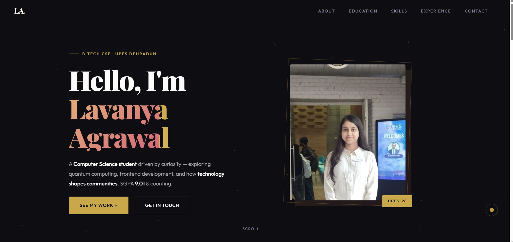

# 🌐 Lavanya Agrawal Portfolio Website

  

A modern personal portfolio website showcasing my skills, projects, achievements, and journey as a Computer Science Engineering student.

---

## 🚀 Live Website

🔗 https://lavanyaagrawal.vercel.app/

---

## 📖 About the Project

This portfolio is my personal online presence where I present my technical skills, projects, education, and career goals.

It reflects my journey in:
- Software Development
- Frontend Web Development
- Problem Solving (DSA)
- Continuous Learning & Growth

---

## ✨ Features

- Fully Responsive Design (Mobile + Desktop)
- Clean & Minimal UI
- Projects Showcase Section
- Skills Overview
- About Me Section
- Contact Information
- Fast and Optimized Performance

---

## 🛠️ Tech Stack

- HTML5
- CSS3
- JavaScript
- Vercel (Deployment)

---

## 👩‍💻 About Me

I am **Lavanya Agrawal**, a B.Tech Computer Science Engineering student passionate about building scalable and user-friendly applications.

### Interests:
- Java Programming
- Data Structures & Algorithms
- Frontend Development
- Problem Solving
- Software Engineering

Currently focused on improving my DSA skills, building projects, and preparing for internships and placements.

---

## 🎯 Goals

- Strengthen Data Structures & Algorithms (Java)
- Master Full Stack Development
- Improve System Design Fundamentals
- Build Real-World Projects
- Prepare for Technical Interviews

---

## 📬 Connect With Me

- 🌐 Portfolio: https://lavanyaagrawal.vercel.app/
- 💻 GitHub: https://github.com/lavanyaag23
- 🔗 LinkedIn: https://linkedin.com/in/lavanya-agrawal-06b57b320

---

## ⭐ Feedback

Feedback, suggestions, and improvements are always welcome. Feel free to connect!

---

  Made with ❤️ by Lavanya Agrawal

